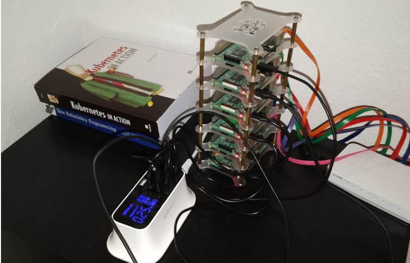

- [k3s-paasmonkeys](#k3s-paasmonkeys)
  * [Why k3s](#why-k3s)
  * [Prerequisites](#prerequisites)
  * [Getting started](#getting-started)
    + [Flash SD Card](#flash-sd-card)
    + [Customize the Raspberry](#customize-the-raspberry)
      - [Set static IP](#set-static-ip)
      - [Enable container features](#enable-container-features)
      - [Add your ssh key](#add-your-ssh-key)
  * [Join Node](#join-node)
  * [Api Gateway](#api-gateway)
- [Credits:](#credits-)
- [License](#license)

# k3s-paasmonkeys
This is a personal project to set a Kubernetes RPi cluster to provide me a private cloud for learning.

## Why k3s
[K3S](https://k3s.io/) is a highly available, certified Kubernetes distribution designed for production workloads in unattended, resource-constrained, remote locations or inside IoT appliances. Both ARM64 and ARMv7 are supported with binaries and multiarch images available for both.

## Prerequisites


* 6 SD card 32GB like [SanDisk 32GB ULTRA microSDHC Card Class 10](https://www.amazon.com/gp/product/B007JTKLEK/ref=as_li_tl?ie=UTF8&camp=1789&creative=9325&creativeASIN=B007JTKLEK&linkCode=as2&tag=alexellisuk-20&linkId=72069d86b6c70e1dc49c2f0ce35f08ef)
* 6 RPi 3b+ (1 Masters and 5 Worker)
* 8-port Ethernet Gigabit Switch like [Netgear GS308](https://www.amazon.de/dp/B07PTTX7MX?aaxitk=SnYYIyTPS3nEg.V.FMD-ig&pd_rd_i=B07PTMXBDK&pf_rd_p=5e2a70c8-77de-4865-9918-07306318c381&hsa_cr_id=8283596160702&sb-ci-n=asinImage&sb-ci-v=https%3A%2F%2Fimages-na.ssl-images-amazon.com%2Fimages%2FI%2F41f7FBBmqpL.jpg&sb-ci-a=B07PTMXBDK&th=1)
* 8-way USB Power-supply
* 6 Ethernet cables
* 6 Micro-USB cables
* RPi 3B+,4B Cluster case like [8 Slot Cluster Cloud](https://www.ebay.de/itm/8-Slot-Cluster-Cloud-For-Raspberry-Pi-4B-3B-and-other-single-board-computers/123315692330?hash=item1cb630232a:m:mgb2CCUuG3V2u1RKG3BDyGg&var=423715705189)

## Getting started
For every RPi that we going to have in our cluster. We have to follow these steps:

### Choose your Cluster node names
I recommend you follow some kind of nomenclature in your nodes naming. It'll be helpful later when you are working with your cluster.
Because of the high availability feature with an embedded DB is experimental. I decided only to use one Master node in my cluster.


### Flash SD Card
* Download [Raspbian Lite](https://www.raspberrypi.org/downloads/raspbian/)
* Flash SD card using [Etcher](https://www.balena.io/etcher/)
* Mount the SD card and create a text file named "ssh" in the boot partition.

### Customize the Raspberry
Insert the SD card and turn on your RPi. It will be accessible on your network over ssh using the following command:
```
ssh pi@raspberrypi.local
```
Log in with the password "raspberry" and then type:
```
sudo raspi-config
```
Do the following actions:
* Set the GPU memory split to 16mb
* Set the hostname
* Change the password for the pi user

#### Set static IP
```
ifconfig | grep -i inet
sudo nano /etc/dhcpcd.conf
```
Add to end of this file:
```
interface eth0
static ip_address=192.168.2.xxx/24
static routers=192.168.2.1
static domain_name_servers=192.168.2.1
```
#### Enable container features
edit /boot/cmdline.txt 
```
sudo nano /boot/cmdline.txt
```
and add the following to the end of the line:
```
cgroup_enable=cpuset cgroup_memory=1 cgroup_enable=memory
```
Now reboot the device:
```
sudo shutdown -r now
```

#### Add your ssh key
Copy public key to the RPi
```
ssh-copy-id pi@k3s-paasmonkey-n0x.local
```
Now you can rely on your public key to log into each RPi without typing a password in.

### Create the cluster
Because of the high availability feature with an embedded DB is experimental. I decided only to use one Master node in my cluster.

## Set the Master
SSH to you our RPi Master
```
ssh pi@k3s-paasmonkey-m01.local
```
Install our Master node in our RPi
```
export SERVER_IP=192.168.2.120
export USER=pi
k3sup install --ip $SERVER_IP --user $USER
```

## Join Node
SSH to our RPi Master
```
ssh pi@k3s-paasmonkey-m01.local
```
Copy public key to the Node
```
ssh-copy-id pi@k3s-paasmonkey-n0x.local
```
Join RPi Node to the RPiCluster
```
export AGENT_IP=192.168.2.xxx
export SERVER_IP=192.168.2.120
export USER=pi
k3sup join --ip $AGENT_IP --server-ip $SERVER_IP --user $USER
```

## Api Gateway
[Here](k3s/kong/README) you can see how deploy an API Gateway in our cluster.

# Credits:
* [Will it cluster? k3s on your Raspberry Pi](https://blog.alexellis.io/test-drive-k3s-on-raspberry-pi/)
* [Inlets Operator — Exposing Services on Private Kubernetes Clusters with a Public IP](https://itnext.io/inlets-operator-exposing-services-on-private-kubernetes-clusters-with-a-public-ip-e701c64693ae)

# License
See the [LICENSE file](LICENSE) for license text and copyright information.